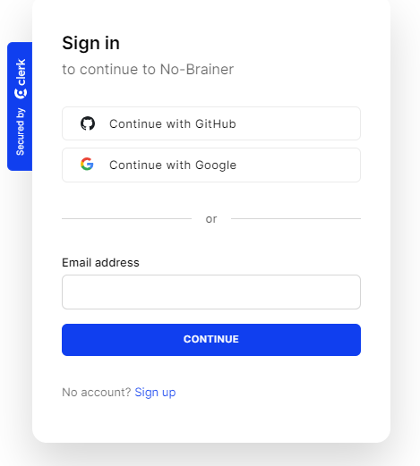
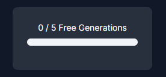

# [SaaS AI Platform](https://no-brainer-ai-saa-s-concept.vercel.app/)

This is a Full Stack SaaS business concept made using Next.js 13 and Tailwind. You can talk with a bot, and generate code, image, audio, and video.  
NOTE - sometimes the generations won't work, because the APIs have their limits. The limits reset every month.

## Front End
Using the power of Next.js 13.4 and React, I have created a responsive and dynamic application that is very user-friendly. I also used ShadCN along with Tailwind for accessible and simple components

## Back End
To handle the Users, Clerk was utilized, which is primarily used to manage the users of an application. 
Below is the list of AI models used for generation.
- Conversation: OpenAI
- Code: OpenAI
- Image: Dall E - OpenAI
- Audio - Replicate
- Video - Replicate

## Key Features:

- Tailwind design
- Tailwind animations and effects
- Full responsiveness
- Clerk Authentication (Email, Google, Github)

- Client form validation and handling using react-hook-form
- Server error handling using react-toast
- Image Generation Tool (Open AI)
- Video Generation Tool (Replicate AI)
- Conversation Generation Tool (Open AI)
- Music Generation Tool (Replicate AI)
- Free tier with API limiting   

- POST, DELETE, and GET routes in route handlers (app/API)
